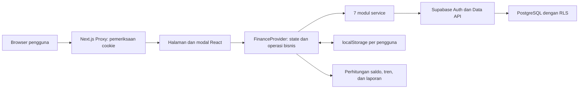

# Laporan Analisis Proyek ZENTA Finance

**Tanggal pemeriksaan:** 10 September 2026, WIB  
**Lokasi:** D:/Finance  
**Objek analisis:** isi working tree, termasuk perubahan lokal yang belum masuk commit  
**Commit acuan:** e4fe95b — feat: transform ZENTA into scalable Next.js App Router finance system  
**Jenis pemeriksaan:** review kode dan skema, build/lint, audit dependensi, uji HTTP lokal, serta simulasi fungsi dengan data sintetis.

## 1. Ringkasan eksekutif

ZENTA Finance merupakan aplikasi manajemen bisnis berbasis Next.js, React, dan Supabase. Fitur utamanya mencakup rekening, transaksi, transfer, penjualan/invoice, produk dan jasa, karyawan, absensi, payroll, laporan, serta cadangan JSON.

**Kesimpulan: fondasi aplikasi dan cakupan fitur sudah cukup baik untuk pengembangan lanjutan, tetapi belum layak dijadikan sumber pencatatan keuangan produksi yang diandalkan tanpa perbaikan integritas data.** Risiko terbesarnya terdapat pada operasi yang harus konsisten bersama: invoice, stok, pembayaran, payroll, dan mutasi kas.

Hasil utama:

- **Validasi terakhir lulus:** `npm run lint` dan `npm run build`.
- **Audit npm:** 0 kerentanan yang dilaporkan registry pada dependency tree saat pemeriksaan. Ini tidak mencakup kesalahan logika aplikasi.
- **15 skenario lokal berhasil mereproduksi perilaku bermasalah.** Contohnya pembayaran ganda, invoice lunas tanpa pemasukan, salah pengurangan stok, impor tidak valid, dan migrasi berulang yang membuat ID baru.
- **Pemeriksaan rute server menerima cookie dengan token palsu.** Respons yang teramati memuat struktur halaman dan data contoh, bukan bukti kebocoran data privat Supabase.
- **Skema memiliki 11 tabel dengan RLS dan 20 indeks eksplisit.** Namun, kepemilikan relasi antartabel, validasi bisnis, transaksi atomik, serta pengujian isolasi pengguna masih perlu diperkuat.
- Klaim performa di laporan terdahulu belum didukung pengukuran runtime yang dapat diverifikasi pada audit ini.

Urutan perbaikan yang disarankan: **integritas transaksi → autentikasi dan isolasi data → backup/restore → kebenaran laporan → performa dan pengalaman pengguna.**

## 2. Ruang lingkup dan batasan bukti

Pemeriksaan mencakup kode aplikasi, service Supabase, utilitas perhitungan dan penyimpanan, skema SQL, konfigurasi dependensi, serta dokumentasi proyek.

| Tingkat bukti | Arti dalam laporan |
|---|---|
| Teruji lokal | Perilaku diamati melalui proses aplikasi lokal atau pemanggilan fungsi sumber dengan data sintetis. |
| Terlihat di kode | Implementasi terkait dapat ditunjukkan, tetapi alur lengkap di browser/cloud belum dijalankan. |
| Risiko bersyarat | Dampaknya bergantung pada konfigurasi, volume data, waktu respons, atau penggunaan bersamaan. |

**Batasan pemeriksaan:**

- Tidak mengakses data bisnis riil, menjalankan mutasi cloud, atau menerapkan SQL ke Supabase.
- Skema yang ditinjau adalah `supabase/schema.sql`; kesesuaiannya dengan database yang sedang digunakan belum diverifikasi.
- Belum dilakukan login dengan akun uji, E2E browser, pengujian RLS dua pengguna, pengukuran Core Web Vitals, pengujian beban, atau EXPLAIN query.
- Simulasi callback menggunakan kode fungsi yang diambil dari sumber dengan service dan state tiruan. Hasilnya membuktikan perilaku logika tersebut, bukan keseluruhan lifecycle React atau transaksi PostgreSQL nyata.
- Sejumlah file berubah selama audit di luar perubahan laporan ini. Lint awal menemukan 5 error; lint terakhir sudah lulus setelah perubahan tersebut terlihat. Audit ini tidak mengubah kode aplikasi untuk memperbaikinya.
- Nilai rahasia tidak dicantumkan. Pemeriksaan konfigurasi hanya melaporkan nama variabel dan klasifikasi key.

## 3. Inventaris teknis

### 3.1 Stack dan versi terpasang

| Komponen | Versi/kondisi teramati |
|---|---|
| Nama package | funbox-finance, versi 1.0.0, private |
| Identitas UI | ZENTA / ZENTA Finance |
| Node.js | 22.14.0 |
| npm | 10.9.2 |
| Next.js | 16.3.4, App Router, Turbopack |
| React / React DOM | 19.2.8 |
| Supabase JS | 2.116.0 |
| Lucide React | 1.42.0 |
| ESLint | 9.39.5 |
| eslint-config-next | 16.3.4 |
| Bahasa | JavaScript/JSX, CSS, SQL |
| State | React Context dan hooks |
| Penyimpanan | Supabase + cache localStorage |
| Perintah proyek | dev, build, start, lint |
| Lockfile | package-lock.json tersedia; deklarasi dependency menggunakan latest |

`npm ls --depth=0` juga melaporkan dua paket extraneous: `@emnapi/runtime` dan `@img/sharp-wasm32`. Ini menunjukkan isi instalasi lokal tidak sepenuhnya bersih terhadap dependency tree, bukan bukti kerentanan.

### 3.2 Ukuran sumber

Penghitungan mencakup berkas JS, JSX, CSS, dan SQL pada lima direktori berikut; tidak termasuk node_modules, .next, dokumentasi, lockfile, dan proxy/config root.

| Direktori | Berkas | Baris |
|---|---:|---:|
| app | 12 | 5.821 |
| components | 20 | 2.954 |
| context | 1 | 1.357 |
| lib | 12 | 1.800 |
| supabase | 1 | 262 |
| **Total** | **46** | **12.194** |

Dua berkas terbesar adalah `app/globals.css` dengan 2.524 baris dan `context/FinanceContext.js` dengan 1.357 baris. Jumlah baris hanya indikator konsentrasi kode, bukan ukuran mutu secara langsung. Angka ini diperbarui setelah perubahan tata letak responsif yang masuk selama audit.

### 3.3 Cakupan halaman

| Rute | Fungsi | Catatan kesiapan |
|---|---|---|
| / | Login dan pendaftaran email/password | Reset password belum terhubung. |
| /dashboard | KPI, tren kas, piutang, stok rendah, onboarding | Beberapa metrik dan status sinkronisasi perlu dikoreksi. |
| /dashboard/accounts | Rekening, saldo, transfer | Penghapusan rekening berdampak pada histori transaksi. |
| /dashboard/transactions | Transaksi, pencarian/filter, CSV | Pagination masih di browser; sejumlah mutasi tidak ditunggu. |
| /dashboard/sales | Invoice, status pesanan/pembayaran, klien | Risiko atomisitas, stok, pembayaran ganda, dan histori. |
| /dashboard/inventory | Katalog barang/jasa dan penyesuaian stok | Belum ada jurnal pergerakan stok. |
| /dashboard/employees | Karyawan, absensi, payroll, slip gaji | Payroll dan kas belum atomik; duplikasi periode belum dibatasi. |
| /dashboard/reports | Ringkasan laba rugi dan aset lancar | Semantik laporan belum lengkap untuk akuntansi menyeluruh. |
| /dashboard/settings | Profil, JSON, migrasi, template | Restore/reset cloud dan sumber migrasi belum konsisten. |

Terdapat 9 halaman aplikasi yang didefinisikan melalui page.js. Build turut menampilkan /_not-found dan melaporkan proses generasi 11/11 halaman; angka proses build tersebut tidak berarti ada 11 fitur halaman bisnis.

## 4. Arsitektur dan aliran data



Pembagian kode sudah memiliki arah yang jelas: halaman menangani tampilan, modal menangani input, service memetakan bentuk data database, dan utilitas memuat perhitungan.

Namun, koordinasi operasi bisnis masih berada dalam satu FinanceProvider. Pembuatan invoice, perubahan stok, dan pemasukan dilakukan melalui beberapa permintaan terpisah dari browser. Tidak ditemukan Route Handler, Server Action, RPC database, atau mekanisme transaksi server untuk menyatukan operasi tersebut.

Karakteristik penyimpanan saat ini:

1. Provider dimulai dengan data contoh.
2. Sesi dan cache pengguna dimuat.
3. Sepuluh pembacaan cloud dijalankan paralel; query orders turut mengambil order_items dan nama klien.
4. Hasil pembacaan yang berhasil menggantikan bagian state; bagian yang gagal tetap memakai nilai sebelumnya.
5. Mayoritas mutasi menunggu cloud sebelum memperbarui state, tetapi sejumlah pemanggil UI tidak menunggu Promise-nya.
6. State disimpan ke localStorage, baik dari callback mutasi maupun effect debounce.
7. Refresh manual tersedia; tidak ditemukan subscription Realtime atau antrean perubahan offline.

Dengan demikian, implementasi ini lebih tepat disebut **CRUD cloud dengan cache lokal**, bukan sinkronisasi offline dua arah atau pembaruan realtime antarpengguna.

## 5. Model data dan pengamanan database

| Tabel | Fungsi | Relasi utama |
|---|---|---|
| profiles | Identitas usaha | id → auth.users |
| accounts | Rekening/kas | user_id → auth.users |
| transactions | Pemasukan/pengeluaran | account_id → accounts |
| transfers | Transfer internal | from_account_id dan to_account_id → accounts |
| clients | Pelanggan | user_id → auth.users |
| products | Barang/jasa | user_id → auth.users |
| orders | Header invoice/pesanan | client_id → clients; paid_account_id → accounts |
| order_items | Rincian invoice | order_id → orders; product_id → products |
| employees | Karyawan | user_id → auth.users |
| attendance | Kehadiran | employee_id → employees |
| payroll | Penggajian | employee_id → employees; account_id → accounts |

Semua tabel bisnis selain profiles memiliki user_id; profiles memakai id pengguna sebagai primary key.

Hal yang sudah baik:

- Sebelas tabel mengaktifkan RLS.
- Policy ditujukan ke authenticated, dengan USING dan WITH CHECK berdasarkan pemilik.
- Bentuk `(select auth.uid())` sudah digunakan.
- Indeks eksplisit sudah mencakup user_id dan foreign key penting.
- NUMERIC digunakan untuk nilai uang; tanggal bisnis menggunakan DATE, timestamp penciptaan menggunakan TIMESTAMPTZ.
- Tidak ditemukan fungsi SECURITY DEFINER atau service-role key dalam kode client yang ditinjau.

Pengamanan RLS tetap harus diuji bersama GRANT yang benar pada database aktual. Kehadiran policy di berkas lokal belum membuktikan deployment-nya sesuai. [Rujukan Supabase RLS](https://supabase.com/docs/guides/database/postgres/row-level-security).

Skema memiliki **3 CHECK constraint bisnis**: tipe transaksi, nominal transaksi nonnegatif, dan nominal transfer positif. Sebelas WITH CHECK pada policy adalah pemeriksaan RLS, bukan tambahan CHECK constraint tabel.

## 6. Temuan prioritas tinggi

**P1** berarti perlu ditangani sebelum aplikasi diandalkan untuk data keuangan produksi. Prioritas ini mempertimbangkan potensi kesalahan catatan, kehilangan kepercayaan pada hasil operasi, dan pengamanan akses; bukan klaim bahwa setiap masalah sudah terjadi pada data pengguna.

### F01 — Invoice, stok, pelunasan, dan payroll tidak atomik

**Bukti:** [salesService.js:110](lib/services/salesService.js#L110), [FinanceContext.js:618](context/FinanceContext.js#L618), [FinanceContext.js:761](context/FinanceContext.js#L761), [FinanceContext.js:1007](context/FinanceContext.js#L1007). **Status:** teruji lokal dengan service tiruan.

Header invoice dan order_items dimasukkan melalui request berbeda. Jika item gagal, header yang sudah tersimpan tidak dibatalkan. Setelah invoice dibuat, perubahan stok dan transaksi kas dilakukan terpisah. Kesalahan operasi pendamping ditelan oleh `.catch(console.error)`.

Simulasi menghasilkan invoice berstatus Lunas dengan nol transaksi pemasukan, serta payroll tersimpan dengan nol transaksi pengeluaran. State stok lokal juga dapat berubah ketika penulisan stok cloud gagal.

**Dampak:** kas, stok, invoice, dan payroll dapat saling bertentangan meskipun UI menganggap operasi selesai.

**Perbaikan:** sediakan operasi transaksi atomik di database/backend untuk setiap peristiwa bisnis, validasi input di batas server, dan kembalikan hasil keseluruhan. Tambahkan identitas sumber pada transaksi, misalnya relasi pembayaran/order/payroll. Jalur kegagalan harus membatalkan seluruh perubahan terkait.

### F02 — UI melaporkan sukses sebelum mutasi cloud selesai

**Bukti:** [TransactionModal.jsx:45](components/finance/TransactionModal.jsx#L45), [TransferModal.jsx:43](components/finance/TransferModal.jsx#L43), [settings/page.js:40](app/dashboard/settings/page.js#L40), [sales/page.js:97](app/dashboard/sales/page.js#L97). **Status:** terlihat di kode.

Fungsi addTransaction, addTransfer, updateProfile, pelunasan invoice, dan sejumlah penghapusan dipanggil tanpa await. Notifikasi sukses dan penutupan modal langsung dijalankan. Try/catch sinkron di sekeliling pemanggilan tidak menangkap Promise yang ditolak kemudian.

**Dampak:** pengguna menerima konfirmasi palsu; indikator pengiriman cepat kembali idle; kegagalan cloud dapat menjadi unhandled rejection. Tombol juga belum selalu mencegah pengiriman berulang.

**Perbaikan:** await mutasi, tangani error di UI, tampilkan status pending selama operasi, dan beri sukses hanya setelah komit berhasil. Terapkan pola ini pada semua pemanggil, bukan hanya definisi service.

### F03 — Pengurangan stok salah untuk produk berulang dan penggunaan bersamaan

**Bukti:** [FinanceContext.js:628](context/FinanceContext.js#L628), [FinanceContext.js:675](context/FinanceContext.js#L675), [InvoiceModal.jsx:69](components/sales/InvoiceModal.jsx#L69). **Status:** kasus item berulang teruji; konflik antarperangkat merupakan risiko dari pola penulisan.

Untuk stok awal 10 dan dua baris produk sama dengan kuantitas 2 serta 3:

| Lokasi | Hasil implementasi | Hasil yang sesuai total penjualan |
|---|---:|---:|
| Request stok cloud | menulis 8, lalu 7 | 5 |
| State lokal | 8 | 5 |

Loop cloud menghitung setiap pengurangan dari data.products yang sama. Pembaruan lokal hanya memakai item pertama melalui find. Dua perangkat dengan snapshot stok yang sama juga dapat saling menimpa karena service menulis nilai stok absolut.

Pemakaian Math.max(0, ...) menyembunyikan penjualan melebihi persediaan: kelebihan penjualan tidak ditolak, stok hanya dijadikan nol.

**Perbaikan:** kelompokkan kuantitas per productId, validasi ketersediaan, dan lakukan pengurangan atomik dengan kontrol konkurensi. Simpan stock_movements untuk penerimaan, penjualan, koreksi, dan retur.

### F04 — Pembayaran dapat tercatat dua kali

**Bukti:** [FinanceContext.js:761](context/FinanceContext.js#L761), [sales/page.js:81](app/dashboard/sales/page.js#L81), [schema.sql:32](supabase/schema.sql#L32). **Status:** teruji lokal.

Pencegahan pembayaran ulang bergantung pada status order dari state browser. Dua pelunasan paralel atas closure yang sama sama-sama membaca kondisi belum lunas dan membuat dua pemasukan. Tidak ada unique key transaksi terhadap pembayaran invoice.

**Perbaikan:** gunakan idempotency key dan constraint unik pada sumber pembayaran, ditambah perubahan status bersyarat dalam transaksi yang sama. Tombol pending membantu UX, tetapi tidak menggantikan proteksi server.

### F05 — Hapus/batalkan invoice tidak mengembalikan stok

**Bukti:** [sales/page.js:105](app/dashboard/sales/page.js#L105), [FinanceContext.js:732](context/FinanceContext.js#L732), [FinanceContext.js:827](context/FinanceContext.js#L827). **Status:** penghapusan teruji lokal; pembatalan terlihat di kode.

Dialog menyatakan stok akan dikembalikan otomatis, tetapi deleteOrder hanya menghapus order. Perubahan status ke Dibatalkan hanya memperbarui status. Tidak ada restorasi stok atau pembalikan transaksi terkait.

Penghapusan payroll juga hanya menghapus record payroll; transaksi kasnya tetap ada. Sebaliknya, transaksi kas pendamping dapat dihapus dari daftar transaksi tanpa mengubah status invoice/payroll.

**Perbaikan:** tentukan lifecycle pembatalan, retur, refund, dan pembalikan payroll. Gunakan transaksi pembalik yang memiliki relasi sumber dan jejak audit. Pengembalian stok perlu mengikuti status penyerahan barang, bukan sekadar menghapus dokumen.

### F06 — Restore/reset dan migrasi lokal-cloud tidak konsisten

**Bukti:** [FinanceContext.js:1103](context/FinanceContext.js#L1103), [FinanceContext.js:1119](context/FinanceContext.js#L1119), [migrationService.js:19](lib/services/migrationService.js#L19), [storage.js:147](lib/storage.js#L147). **Status:** terlihat di kode; sumber migrasi dan ID berulang teruji lokal.

- Import JSON dan reset hanya mengubah state/cache, tanpa menulis ulang data cloud. Refresh dapat memunculkan data lama kembali dan menimpa hasil restore.
- Import pengguna login memakai cache `zenta_user_data_<userId>`.
- Migrasi memanggil loadLocalData() tanpa userId, sehingga membaca cache legacy bersama `zenta_business_data_v2`, bukan data yang baru diimpor ke akun tersebut.
- Jika cache legacy kosong, loadLocalData mengembalikan contoh data. Tombol migrasi dapat mengunggah contoh meskipun tidak ada data lokal pengguna.
- Pemetaan ID legacy dibuat baru setiap migrasi; ID item invoice selalu dibuat baru. Upsert berdasarkan id tidak mencegah duplikasi antarpercobaan tersebut.
- Migrasi dan seeder berjalan bertahap tanpa komit tunggal. Seeder menulis profil contoh dan menciptakan record baru setiap kali dipanggil.

Simulasi dua migrasi tanpa cache menghasilkan tiga rekening per pemanggilan dengan ID yang berbeda.

**Perbaikan:** pisahkan import, pemulihan cloud, migrasi legacy, pembersihan cache, dan pengisian template. Tentukan sumber data eksplisit, validasi snapshot, gunakan pemetaan ID yang persisten/idempotent, dan tampilkan ringkasan perubahan sebelum komit. Seeder perlu aman saat diulang dan tidak menimpa profil aktif.

### F07 — Impor JSON dapat menerima struktur yang merusak state

**Bukti:** [FinanceContext.js:1103](context/FinanceContext.js#L1103), [storage.js:155](lib/storage.js#L155), [settings/page.js:48](app/dashboard/settings/page.js#L48). **Status:** teruji lokal.

Validasi import hanya memastikan nilai berupa object. Payload `{"accounts":{"invalid":true}}` diterima, lalu calculateAccountBalances gagal karena accounts bukan array. Field lain, relasi, ID, tanggal, nominal, dan versi format juga belum diverifikasi menyeluruh.

Cache pengguna yang JSON-nya rusak jatuh ke getInitialData(), sehingga memunculkan tiga rekening contoh alih-alih data kosong yang ditandai gagal dimuat.

**Perbaikan:** gunakan schema version dan validasi seluruh struktur sebelum mengubah state. Periksa tipe setiap koleksi, batas ukuran file, ID unik, relasi, enum, tanggal, dan bilangan finite. Kegagalan cache pengguna harus tetap terpisah dari mode demo.

### F08 — Seluruh laporan bergantung pada pembacaan data yang belum dipaginasi

**Bukti:** [FinanceContext.js:71](context/FinanceContext.js#L71), [transactionsService.js:46](lib/services/transactionsService.js#L46), [salesService.js:99](lib/services/salesService.js#L99). **Status:** terlihat di kode; pemotongan data bergantung pada batas Data API aktual.

Service mengambil select(*) tanpa range, pagination loop, atau pemeriksaan jumlah total. Pagination tabel hanya slice array browser: 12 transaksi atau 10 invoice per halaman.

Jika API membatasi jumlah hasil, saldo, piutang, payroll, ekspor, dan laporan dihitung dari subset tanpa pemberitahuan. Batas aktual proyek belum diperiksa; angka 1.000 pada dokumentasi referensi legacy tidak diperlakukan sebagai konfigurasi yang sudah terbukti untuk proyek ini. [Referensi resmi tentang batas hasil dan pagination](https://supabase.com/docs/reference/javascript/v1/select).

**Perbaikan:** gunakan filter/pagination server untuk daftar, count yang sesuai, dan agregasi database untuk saldo/laporan. Ekspor harus membaca seluruh cakupan yang diminta secara terkontrol. Uji dataset di atas batas respons proyek.

### F09 — Proxy memeriksa keberadaan token, bukan keabsahan sesi

**Bukti:** [proxy.js:3](proxy.js#L3), [supabase.js:18](lib/supabase.js#L18), [dashboard/layout.js:16](app/dashboard/layout.js#L16). **Status:** teruji HTTP lokal.

| Request lokal | Respons |
|---|---|
| GET / tanpa cookie | 200 |
| GET /dashboard tanpa cookie | 307 menuju / |
| GET /dashboard/accounts dengan sb-access-token=invalid-token | 200 |
| GET / dengan cookie palsu yang sama | 307 menuju /dashboard |

HTML rekening yang diterima memuat data contoh. Ini membuktikan kelemahan pemeriksaan rute, **bukan bypass RLS atau akses data bisnis pengguna lain**. Guard client melakukan pemeriksaan sesudah halaman mulai dirender.

Cookie token disalin manual dari client dengan masa simpan tujuh hari. Proxy tidak memeriksa signature/expiry dan tidak menyegarkan sesi. Cookie stale dapat membuat keputusan redirect server berbeda dari sesi client.

**Perbaikan:** gunakan integrasi sesi cookie Supabase yang konsisten untuk browser dan server, validasi identitas dengan getClaims atau getUser sesuai kebutuhan, serta pertahankan RLS sebagai otorisasi data. Panduan Next.js lokal menyatakan Proxy tidak cukup sebagai solusi otorisasi lengkap; panduan Supabase menjelaskan validasi token dan refresh sesi. [Supabase SSR untuk Next.js](https://supabase.com/docs/guides/auth/server-side/nextjs).

### F10 — Relasi antartabel belum menjamin pemilik yang sama

**Bukti:** [schema.sql:32](supabase/schema.sql#L32), [schema.sql:104](supabase/schema.sql#L104), [schema.sql:129](supabase/schema.sql#L129), [schema.sql:199](supabase/schema.sql#L199). **Status:** risiko skema; belum diuji pada database aktual.

Policy memeriksa user_id baris yang sedang ditulis. Foreign key memeriksa ID parent, tetapi tidak mengikat user_id child dengan user_id parent. Contohnya transaksi milik A dapat mencoba mereferensikan rekening B, atau order_items milik A mereferensikan order B jika ID parent diketahui.

Pemeriksaan referential integrity PostgreSQL tidak tunduk pada RLS dengan cara yang sama seperti query pengguna. Karena itu, keberadaan owner policy saja tidak menjamin relasi satu pemilik. Ini merupakan inferensi dari DDL dan perilaku PostgreSQL, bukan temuan eksploitasi cloud. [Dokumentasi PostgreSQL tentang RLS dan foreign key](https://www.postgresql.org/docs/current/ddl-rowsecurity.html).

**Perbaikan:** tegakkan relasi kepemilikan, misalnya composite foreign key yang mencakup user_id dan id atau validasi parent yang tepat. Tambahkan pengujian SELECT/INSERT/UPDATE/DELETE untuk pengguna A, B, dan anonymous, termasuk semua relasi child-parent.

### F11 — Nilai kewajiban kartu kredit salah tanda

**Bukti:** [calculations.js:4](lib/calculations.js#L4), [calculations.js:51](lib/calculations.js#L51). **Status:** teruji lokal.

Saldo semua rekening dihitung dengan rumus kas. Pengeluaran kartu kredit Rp1.000.000 dari saldo awal nol menghasilkan saldo -Rp1.000.000. calculateNetWorth hanya menghitung saldo kartu kredit positif sebagai kewajiban, sehingga kewajiban menjadi Rp0.

**Dampak:** net worth dapat terlalu tinggi dan pembayaran tagihan tidak mempunyai interpretasi yang konsisten.

**Perbaikan:** tetapkan konvensi debit/kredit untuk akun kewajiban dan bedakan pembelian kredit dari pembayaran utang. Uji pembelian, cicilan/pelunasan, refund, saldo awal utang, dan kelebihan pembayaran.

### F12 — Sinkronisasi gagal tetap dianggap berhasil

**Bukti:** [FinanceContext.js:46](context/FinanceContext.js#L46), [Topbar.jsx:143](components/layout/Topbar.jsx#L143). **Status:** teruji lokal.

Promise.allSettled menangkap penolakan semua pembacaan, tetapi hasil rejected tidak dihimpun menjadi error pengguna. Bahkan jika sepuluh service gagal, fetchCloudData tetap resolve. Pemanggil dapat menampilkan toast sukses.

Badge Cloud Aktif ditentukan oleh keberadaan user, bukan keberhasilan koneksi/pembacaan. Hasil sebagian juga mencampur data terbaru dan cache tanpa menandai umur masing-masing.

**Perbaikan:** kembalikan hasil sinkronisasi terstruktur, jumlah operasi gagal, lastSuccessfulSync, serta status stale/offline. Kegagalan penting harus diteruskan ke pemanggil. Batasi perhitungan sensitif jika dataset yang diperlukan belum lengkap.

## 7. Temuan tambahan: ketepatan data dan pemeliharaan

Temuan berikut diklasifikasikan **P2**: penting untuk stabilitas, ketepatan fitur, dan kemampuan pemeliharaan; beberapa menjadi penghambat rilis ketika fitur terkait digunakan.

### F13 — Nama pelanggan bebas dan identitas historis invoice tidak dipertahankan

**Bukti:** [InvoiceModal.jsx:90](components/sales/InvoiceModal.jsx#L90), [salesService.js:24](lib/services/salesService.js#L24), [schema.sql:86](supabase/schema.sql#L86). **Status:** pemetaan nama teruji lokal; perubahan histori terlihat di kode.

Form mengizinkan nama pelanggan bebas, tetapi orders tidak menyimpan client_name. Mapper memakai nama hasil join clients atau Klien Umum. Nama bebas hilang saat data melalui mapper cloud. Nama, alamat pelanggan, profil usaha, dan rekening cetak juga diambil dari data master saat ini; perubahan master dapat mengubah dokumen lama.

Pelunasan dari daftar memakai accounts[0], sedangkan cetak invoice memilih rekening Bank pertama. Pengguna tidak memilih rekening penerimaan pada alur pelunasan tersebut.

**Perbaikan:** simpan snapshot identitas yang relevan saat penerbitan, pertahankan nama pelanggan bebas, dan gunakan rekening pembayaran/instruksi yang dipilih secara eksplisit. Data master tetap dapat menjadi referensi, tetapi bukan satu-satunya sumber isi dokumen historis.

### F14 — Fallback angka nol menyebabkan valuasi dan notifikasi salah

**Bukti:** [calculations.js:155](lib/calculations.js#L155), [inventoryService.js:15](lib/services/inventoryService.js#L15), [dashboard/page.js:100](app/dashboard/page.js#L100). **Status:** valuasi dan mapper teruji lokal.

- costPrice=0 diganti dengan harga jual karena memakai operator ||. Dua unit dengan modal nol dan harga jual Rp10.000 dinilai memiliki modal Rp20.000.
- min_stock=0 dipetakan menjadi 5. Batas stok nol yang valid tidak dipertahankan.
- Daftar stok rendah pada dashboard tidak menyaring type=service. Jasa yang stoknya memang nol berpotensi tampil sebagai stok kritis; halaman katalog sudah memisahkan barang fisik.

**Perbaikan:** bedakan nilai kosong dari nol, misalnya dengan pemeriksaan null/undefined yang eksplisit; terapkan filter jasa yang sama di seluruh komponen dan penghitungan.

### F15 — Semantik laporan belum mewakili akuntansi bisnis secara menyeluruh

**Bukti:** [calculations.js:74](lib/calculations.js#L74), [reports/page.js:49](app/dashboard/reports/page.js#L49), [constants.js](lib/constants.js), [schema.sql](supabase/schema.sql). **Status:** terlihat di kode.

Laba rugi menjumlahkan transaksi income/expense. HPP hanya muncul jika dicatat sebagai transaksi pengeluaran dengan kategori persis Beban Pokok Penjualan (HPP). Penjualan produk yang mengurangi persediaan tidak otomatis menghasilkan pencatatan biaya pokok dan tidak menyimpan snapshot cost per item.

Piutang dihitung dari seluruh grandTotal pesanan yang belum lunas. Status Sebagian tersedia dalam konstanta/skema, tetapi tidak ada ledger nominal pembayaran sebagian. Ringkasan net worth dashboard hanya memakai saldo rekening; nilai stok dan piutang baru ditambahkan dalam ringkasan aset pada halaman laporan. Filter periode P&L juga tidak mengubah saldo aset saat ini menjadi posisi historis pada tanggal akhir periode.

Ada penggunaan NUMERIC tanpa precision/scale di database, konversi ke JavaScript Number, serta pembulatan di beberapa tahapan perhitungan. Penanganan uang pecahan, angka sangat besar, dan kesamaan total dengan rincian belum memiliki kontrak tertulis.

**Perbaikan:** tetapkan basis dan cakupan laporan; pisahkan penerimaan kas, pengakuan pendapatan, biaya pokok, dan perubahan aset sesuai model bisnis yang dipilih. Tambahkan nominal pembayaran/remaining balance, snapshot biaya, dan pengujian rekonsiliasi. Jika hanya mendukung rupiah bulat, tegakkan itu pada input, penyimpanan, serta kalkulasi. Hindari label yang menyiratkan laporan akuntansi lengkap sebelum seluruh komponen yang dibutuhkan tersedia.

### F16 — Constraint, histori perubahan, dan migrasi database belum memadai

**Bukti:** [schema.sql](supabase/schema.sql), [FinanceContext.js:279](context/FinanceContext.js#L279), [migrationService.js](lib/services/migrationService.js). **Status:** terlihat di kode dan skema.

Belum terlihat pembatasan untuk:

- Keunikan nomor invoice per pemilik dan SKU bila memang wajib unik.
- Duplikasi absensi karyawan per tanggal.
- Duplikasi payroll reguler per karyawan/periode.
- Kuantitas item positif, stok/harga tidak negatif, validitas status, rekening sumber berbeda dari tujuan.
- Konsistensi subtotal, diskon, grand_total, net_salary, dan detail sumbernya.

Nomor invoice dibuat dari angka acak empat digit tanpa constraint unik. UUID record tidak menjamin nomor dokumen bisnis unik.

ON DELETE CASCADE pada accounts → transactions/transfers dan employees → attendance/payroll memungkinkan histori ikut hilang ketika master dihapus. Tidak tersedia audit log, periode tutup buku, atau peristiwa pembalik terstruktur.

DDL CREATE TABLE IF NOT EXISTS mendefinisikan database baru, tetapi tidak memperbarui kolom tabel yang sudah ada. Tidak ditemukan direktori migrasi berurutan, konfigurasi Supabase lokal, maupun tes skema. Skrip juga tidak mendeklarasikan GRANT secara eksplisit; hasil akses bergantung pada konfigurasi proyek.

**Perbaikan:** gunakan migrasi versi yang dapat diuji dari database kosong dan versi sebelumnya; tambahkan constraint berdasarkan aturan bisnis yang disepakati. Gunakan arsip/nonaktif untuk master yang sudah direferensikan dan audit trail untuk perubahan penting. Payroll koreksi atau pembayaran bertahap memerlukan model tersendiri sebelum menetapkan unique key.

### F17 — Form profil dapat menyimpan nilai lama/default setelah data cloud tiba

**Bukti:** [settings/page.js:27](app/dashboard/settings/page.js#L27), [FinanceContext.js:31](context/FinanceContext.js#L31). **Status:** risiko yang terlihat dari lifecycle kode.

Form profil diinisialisasi sekali dari profile ketika komponen dibuat. Provider dimulai dengan profil contoh dan dimutakhirkan secara asinkron. Tidak terlihat mekanisme menyelaraskan form yang belum diedit dengan profil yang baru dimuat.

**Dampak:** pengguna yang langsung membuka Settings dapat melihat atau menyimpan nilai default sehingga menimpa profil cloud. F02 memperburuknya karena penyimpanan profil langsung mengumumkan sukses.

**Perbaikan:** tunggu data profil siap atau lakukan reset form berbasis identitas/versi data ketika form belum dirty; jangan menimpa edit yang sedang berlangsung.

### F18 — Cache dan refresh memiliki risiko kehilangan pembaruan sementara

**Bukti:** [FinanceContext.js:46](context/FinanceContext.js#L46), [FinanceContext.js:125](context/FinanceContext.js#L125), [FinanceContext.js:155](context/FinanceContext.js#L155), [storage.js:294](lib/storage.js#L294). **Status:** risiko konkurensi dari kode, belum diuji dengan browser multiperangkat.

Pembacaan cloud mengganti array state saat selesai tanpa generation token, AbortController, atau pemeriksaan bahwa pengguna/request masih sama. Snapshot fetch yang dimulai sebelum sebuah mutasi dapat datang setelah mutasi dan sementara menimpa hasil baru.

Cooldown fetch tidak dikunci per pengguna. Panggilan refresh saat request sedang berjalan langsung return, termasuk forceRefresh. Seeder memanggil fetch tanpa memaksa melewati cooldown. Data baru dapat belum terlihat meskipun operasi pemanggil selesai.

Pada SIGNED_IN, cache dimuat ulang sebelum fetch. Belum ada antrian write offline, penyelesaian konflik, atau penanda perubahan yang belum terkirim. Cache keuangan dan karyawan tetap berada dalam localStorage sesudah logout; pemisahan key per pengguna tidak mengenkripsi data perangkat.

**Perbaikan:** gunakan request generation dan identitas pemilik sebelum menerapkan hasil; invalidasi data setelah komit; kembalikan Promise request yang sedang berjalan atau antrekan refresh berikutnya. Dokumentasikan kebijakan retensi cache dan perangkat bersama. Jika offline write memang dibutuhkan, rancang outbox dan konflik secara eksplisit.

### F19 — Ekspor CSV belum aman dan belum mengikuti filter

**Bukti:** [storage.js:314](lib/storage.js#L314), [transactions/page.js:139](app/dashboard/transactions/page.js#L139), [FinanceContext.js:1115](context/FinanceContext.js#L1115). **Status:** encoding dan isi formula teruji lokal; filter terlihat di kode.

Nilai teks dikutip untuk CSV, tetapi formula seperti =1+1 tetap masuk sebagai isi sel. Program spreadsheet dapat menafsirkannya sebagai formula; perilaku pastinya perlu diuji pada aplikasi spreadsheet sasaran. Menggandakan tanda kutip tidak sama dengan menetralisir formula. [OWASP CSV Injection](https://owasp.org/www-community/attacks/CSV_Injection).

Ekspor menggunakan data URI dengan encodeURI. Tanda # pada catatan tetap menjadi fragmen URL. Simulasi catatan dengan #invoice menghasilkan URL fragment, sehingga isi file berisiko terpotong atau berbeda dari data sumber.

Tombol ekspor memanggil exportCSV seluruh transaksi yang ada dalam state, tanpa meneruskan hasil filter tampilan. Tidak ditemukan generator file XLSX; dukungan Excel saat ini berupa CSV.

**Perbaikan:** buat unduhan memakai Blob/object URL, tentukan kebijakan teks/formula yang diuji untuk spreadsheet sasaran, dan buat cakupan ekspor jelas: hasil filter atau seluruh data. Pastikan pengambilan data lengkap sebagaimana F08.

## 8. Analisis performa

### 8.1 Optimasi yang benar-benar terlihat

- fetchCloudData sudah memakai useCallback dengan dependency kosong.
- Guard isFetchingRef dan cooldown empat detik sudah tersedia.
- Provider value dan beberapa computed values sudah memakai useMemo.
- Cache dibedakan menurut ID pengguna.
- Ada effect penyimpanan dengan debounce 400 ms.
- Daftar transaksi dan invoice memiliki pagination tampilan.
- Grafik SVG tidak menambah library chart terpisah.

Ini merupakan perbaikan struktur yang nyata. Dampak terhadap latensi, frame rendering, dan jumlah request per sesi masih perlu diukur.

### 8.2 Hambatan yang masih tersisa

| Area | Temuan | Implikasi |
|---|---|---|
| Context tunggal | Hook domain tetap memanggil useFinance; halaman juga masih memakai useFinance langsung. | Perubahan domain atau isSyncing tetap memberi nilai context baru ke semua konsumennya. Hook pembungkus belum mengisolasi subscription. |
| Penulisan cache | Banyak callback mutasi masih memanggil saveLocalData langsung di dalam updater setData. | JSON.stringify/setItem tetap sinkron dan dapat ditulis lagi oleh effect debounce. |
| Efek samping updater | Updater state melakukan I/O cache dan di beberapa jalur membuat ID. | Updater tidak sepenuhnya murni; evaluasi ulang menjadi lebih sulit diprediksi dan diuji. |
| Memuat semua domain | Membuka satu dashboard memicu pembacaan rekening sampai payroll sekaligus. | Biaya unduh, parsing, dan memori bertambah dengan seluruh data usaha. |
| Komputasi saldo | Setiap rekening memfilter transaksi dan transfer berkali-kali. | Kompleksitas kira-kira O(A × (T + R)), dengan A=akun, T=transaksi, R=transfer. |
| Daftar selain invoice/transaksi | Sejumlah halaman memetakan seluruh data tanpa pagination. | DOM dan render dapat membesar ketika data bertambah. |
| CSS/font | CSS global 2.524 baris; font diimpor dari Google Fonts. | Ada ketergantungan jaringan font dan ruang untuk pemisahan style. Tidak ada pengukuran biaya aktual pada audit ini. |

Debounce hanya menunda dan mengurangi frekuensi pemanggilan. Debounce tidak membuat JSON.stringify maupun localStorage.setItem menjadi operasi asinkron/nonblocking.

**Arah perbaikan:** prioritaskan pembacaan per domain, pagination/agregasi server, satu jalur penulisan cache, indeks data dalam memori untuk saldo, lalu subscription state yang lebih sempit. Ukur terlebih dahulu sebelum mengganti seluruh state management.

### 8.3 Penilaian ulang laporan performa terdahulu

| Klaim terdahulu | Hasil evaluasi ulang |
|---|---|
| Build cepat membuktikan Supabase bukan penyebab lambat | Tidak dapat disimpulkan. Waktu build berbeda dari waktu request database, unduh data, dan render interaksi. |
| Terjadi 30–40 atau 60–80 request setiap pembukaan | Tidak ada capture jaringan pada audit ini yang membuktikan angka tersebut. Kode sekarang mempunyai deduplikasi. |
| Memoization mengurangi render 70% | Belum ada baseline/profiler yang memvalidasi persentase ini. |
| Semua blocking localStorage sudah hilang | Tidak benar untuk implementasi saat ini; pemanggilan langsung masih tersebar. |
| Hook domain sudah memisahkan re-render | Hook yang tersedia masih berlangganan context yang sama. |
| Navigasi sudah instan dan redirect ping-pong selesai | Perlu E2E sesi valid, kedaluwarsa, dan cookie tidak sinkron. Pemeriksaan token palsu masih lolos server. |
| Sepuluh request hanya sekali per sesi | Guard bekerja per request/cooldown, bukan jaminan satu fetch per sesi. Refresh manual dan event auth dapat memicu fetch kembali. |

## 9. UI, aksesibilitas, dan pengalaman pengguna

Kekuatan yang terlihat dari sumber meliputi bahasa Indonesia, format rupiah/tanggal lokal, komponen modal yang dapat dipakai ulang, status tombol pada sejumlah form, toast, konfirmasi penghapusan, navigasi mobile, serta style cetak.

Kekurangan yang perlu ditangani:

| Area | Temuan dan saran |
|---|---|
| Modal umum | Ada role=dialog, aria-modal, dan Escape, tetapi belum ada aria-labelledby, penguncian fokus, fokus awal, atau pengembalian fokus. |
| ConfirmModal | Belum memakai semantik dialog yang lengkap, Escape, atau pengelolaan fokus; tombol tutup ikon belum memiliki nama aksesibel. |
| Toast | Belum memiliki live region/status/alert untuk pengumuman pembaca layar. |
| Login | Ingat saya tidak terhubung ke perilaku sesi; tombol Lupa kata sandi tidak memiliki handler. |
| Loading | Dashboard utama memakai skeleton, tetapi sebagian halaman lain dapat menampilkan data awal sebelum cloud siap. |
| Responsif | Perubahan terbaru menambahkan grid berbasis class untuk dashboard, Settings, filter, dan laporan; breakpoint 1024/768/640/480 px tersedia. Hambatan grid inline yang terlihat sebelumnya sudah ditangani. Kualitas hasil pada perangkat nyata masih perlu diuji. |
| Cetak | window.print dan CSS cetak tersedia, tetapi style belum secara eksplisit mengisolasi semua isi halaman belakang modal. Hasil cetak invoice/slip perlu diperiksa langsung. |
| Animasi | Belum ditemukan preferensi reduced motion. |
| Pagination | Reset halaman mengikuti perubahan filter, tetapi perubahan jumlah data akibat hapus/refresh belum selalu membatasi nomor halaman ke rentang valid. |

Penilaian ini berasal dari markup/CSS. Tidak ada klaim hasil screenshot, pengujian keyboard nyata, rasio kontras, atau skor Lighthouse.

## 10. Kualitas kode, keamanan operasional, dan deployment

### 10.1 Hal positif

Service dipisahkan menurut domain, banyak mapper data eksplisit, formatter tanggal menggunakan kalender lokal, perhitungan tren tidak lagi membentuk bulan melalui UTC, dan akhir bulan laporan dihitung dinamis. Mayoritas form modal baru sudah menunggu operasi asinkron. Build dan lint final berhasil.

Tidak ditemukan penggunaan dangerouslySetInnerHTML atau konstruksi raw SQL dari input pengguna pada sumber aplikasi yang diperiksa. Ini bukan bukti bahwa seluruh kelas kerentanan telah dieliminasi.

### 10.2 Kesenjangan pengembangan

- Tidak ditemukan test script, suite unit/integrasi/E2E, atau workflow CI proyek.
- Seluruh kode bisnis masih JavaScript tanpa tipe domain/generated database types. Tahap bertuliskan Running TypeScript pada output Next.js bukan bukti adanya pemeriksaan tipe bisnis yang menyeluruh.
- FinanceProvider menduplikasi implementasi mutasi lokal dan cloud dalam satu berkas besar.
- Kesalahan banyak berakhir di console; belum terlihat pelacakan exception, metrik keberhasilan sinkronisasi, atau audit event bisnis.
- Tidak ditemukan error.js/loading.js khusus rute maupun prosedur pemulihan ketika state impor rusak.
- Task.md memuat klaim selesai seperti rollback, isolasi render, dan sinkronisasi penuh yang lebih kuat daripada implementasi yang teramati.

**Saran:** gunakan tipe atau schema runtime untuk payload bisnis, pecah orkestrasi domain setelah invariannya diuji, dan jadikan test transaksi/RLS serta lint/build sebagai gerbang CI.

### 10.3 Konfigurasi dan dokumentasi

README menyebut minimum Node.js 18.17, sedangkan dokumentasi Next.js yang terpasang menyatakan minimum 20.9. Lingkungan pemeriksaan memakai 22.14.0 sehingga memenuhi syarat tersebut. [Dokumentasi instalasi lokal](node_modules/next/dist/docs/01-app/01-getting-started/01-installation.md).

Dua environment variable yang ditemukan:

```dotenv
NEXT_PUBLIC_SUPABASE_URL=<URL proyek>
NEXT_PUBLIC_SUPABASE_ANON_KEY=<key publik untuk akses dengan RLS>
```

Key yang diperiksa memiliki claim role=anon. Nilainya tidak dicantumkan. Tidak ada file .env yang terlacak oleh Git pada pemeriksaan saat ini; .gitignore mengabaikan .env* dan mengizinkan .env.example, tetapi file contoh tersebut belum tersedia.

lib/supabase.js melempar error ketika variabel belum tersedia. Karena itu, jalur if (!supabase) untuk mode lokal tidak dapat dijadikan cara menjalankan aplikasi tanpa konfigurasi. README perlu menjelaskan instalasi, konfigurasi environment, penerapan migrasi, pembuatan akun, dan batas mode offline.

Deklarasi dependency latest tetap ditahan oleh lockfile pada instalasi yang mengikuti lockfile. Untuk rilis yang konsisten, gunakan npm ci dan versi/rentang paket yang disengaja; jangan menyamakan audit npm bersih dengan jaminan bebas masalah.

Belum ditemukan konfigurasi deployment, pemisahan staging/produksi, prosedur rollback, atau prosedur backup/restore database yang tervalidasi. Header keamanan dari hosting dan konfigurasi Supabase Auth/RLS/GRANT aktual juga belum diperiksa.

Model akses saat ini adalah data per pengguna. Belum ada organisasi, anggota tim, peran kasir/admin, atau approval transaksi. Bila satu usaha akan dipakai beberapa staf dengan login berbeda, kebutuhan tersebut memerlukan model akses tambahan; login banyak pengguna saat ini tidak otomatis berarti kolaborasi pada usaha yang sama.

## 11. Hasil verifikasi yang dijalankan

### 11.1 Pemeriksaan proyek

| Pemeriksaan | Hasil | Batas interpretasi |
|---|---|---|
| npm ls --depth=0 | Versi teridentifikasi; 2 paket extraneous | Tidak dilakukan instalasi bersih. |
| npm run lint awal | Gagal, 5 error | Terjadi sebelum file terkait berubah selama audit. |
| npm run lint terakhir | Lulus, exit 0 | Berlaku pada working tree yang terakhir diperiksa. |
| npm run build terakhir | Lulus, exit 0 | Setelah perubahan responsif: kompilasi 1.879 ms; generasi halaman 1.646 ms. Angka ini adalah durasi tahap build, bukan latensi penggunaan. |
| npm audit --json | 0 vulnerability; total metadata dependensi 407 | Hanya temuan yang dikenal registry pada saat pemeriksaan. |
| git diff --check | Menemukan trailing whitespace di app/page.js dan baris kosong tambahan di akhir ProductModal.jsx | Masalah format pada perubahan lokal yang sudah ada; tidak menghalangi lint/build terakhir. |
| Server produksi lokal | Berhasil start pada 127.0.0.1:3310 | Dipakai untuk uji HTTP tanpa akun/cloud; telah dihentikan. |
| HTTP rute | Perilaku redirect dan token palsu terverifikasi | Tidak menguji otorisasi database. |
| 15 simulasi fungsi | Perilaku masalah berhasil direproduksi | Bukan suite regresi aplikasi yang lulus. |

Lima error lint awal berada pada duplicate prop halaman employees, reset state dalam effect halaman sales/transaksi dan provider, serta aturan immutability pada ExpenseDonut. Setelah perubahan working tree, kelimanya tidak muncul pada lint terakhir.

Tidak ada benchmark runtime cloud yang dijalankan. Angka build di atas tidak digunakan sebagai angka latensi dashboard.

### 11.2 Daftar 15 skenario lokal

| No. | Skenario sintetis | Hasil teramati |
|---:|---|---|
| 1 | Pengeluaran kartu kredit Rp1.000.000 dari nol | Saldo -Rp1.000.000, kewajiban Rp0. |
| 2 | Produk modal 0, harga jual Rp10.000, stok 2 | Valuasi modal Rp20.000. |
| 3 | min_stock=0 melalui mapper | Menjadi minStock=5. |
| 4 | Stok 10; produk sama pada dua item qty 2 dan 3 | Cloud ditulis 8 lalu 7; lokal 8; semestinya 5. |
| 5 | Invoice lunas, penulisan stok dan kas dipaksa gagal | Order tersimpan, transaksi 0, stok lokal tetap berubah. |
| 6 | Hapus invoice | Order hilang; stok tidak berubah. |
| 7 | Dua pelunasan paralel pada status awal belum lunas | Dua transaksi pemasukan. |
| 8 | Payroll berhasil, penulisan kas dipaksa gagal | Payroll tersimpan, transaksi pengeluaran 0. |
| 9 | Impor accounts berbentuk object | Import diterima; kalkulasi melempar TypeError. |
| 10 | Semua 10 fetch service ditolak | fetchCloudData resolve tanpa pelaporan error. |
| 11 | Cache pengguna mengandung JSON rusak | Mengembalikan 3 rekening contoh. |
| 12 | Migrasi dua kali tanpa cache legacy | Mengambil data contoh; ID rekening berbeda antarpercobaan. |
| 13 | Catatan CSV diawali formula dan memuat #invoice | Formula tidak dinetralisir; # menjadi URL fragment. |
| 14 | Header invoice sukses, insert item gagal | Error item diteruskan; tidak ada rollback header. |
| 15 | Mapper invoice tanpa relasi klien, dengan nama bebas | Nama menjadi Klien Umum. |

Harness sementara dijalankan di direktori build menggunakan data palsu dan tanpa koneksi Supabase. Direktori tersebut dibuat ulang oleh build terakhir; harness bukan berkas suite pengujian permanen proyek.

### 11.3 Contoh reproduksi minimal

Contoh berikut dapat dijalankan dari root dengan Node untuk memeriksa dua utilitas tanpa environment cloud:

```javascript
import {
  calculateAccountBalances,
  calculateNetWorth,
  calculateInventoryValuation,
} from "./lib/calculations.js";

const balances = calculateAccountBalances(
  [{ id: "cc", type: "Kartu Kredit", initialBalance: 0 }],
  [{ accountId: "cc", type: "expense", amount: 1000000 }],
  []
);

console.log(calculateNetWorth(balances));
// Implementasi saat audit: totalLiabilities = 0.

console.log(calculateInventoryValuation([
  { stock: 2, costPrice: 0, price: 10000 },
]));
// Implementasi saat audit: totalCostValuation = 20000.
```

## 12. Rencana perbaikan yang disarankan

Tahapan di bawah adalah usulan pekerjaan, bukan perubahan yang sudah diterapkan oleh audit.

| Tahap | Pekerjaan | Kriteria selesai |
|---|---|---|
| 1. Integritas transaksi | F01–F05: transaksi atomik, idempotensi, ledger stok/pembayaran, await pada pemanggil | Simulasi kegagalan setiap langkah tidak meninggalkan data parsial; pembayaran ulang tidak menggandakan kas; stok sesuai jumlah seluruh item. |
| 2. Akses dan skema | F09–F10, F16: sesi tervalidasi, kepemilikan relasi, constraint, migrasi versi | Token invalid/expired ditangani benar; pengguna A/B tidak dapat membuat relasi silang; migrasi berhasil dari versi lama dan database kosong. |
| 3. Pemulihan dan sinkronisasi | F06–F08, F12, F17–F18 | Backup valid dapat dipulihkan ke akun uji dan bertahan setelah refresh; import invalid tidak mengubah data; migrasi ulang tidak menggandakan record; fetch gagal diberi status jelas. |
| 4. Ketepatan bisnis | F11, F13–F15, F19 | Saldo, kewajiban, piutang, modal, detail invoice, dan ekspor dapat direkonsiliasi pada dataset uji yang disepakati. |
| 5. Performa dan UX | Bagian 8–9 | Baseline runtime tersedia; daftar besar memakai query terbatas; dialog dapat dioperasikan dengan keyboard; hasil cetak sesuai dokumen. |
| 6. Rilis yang dapat diulang | Bagian 10–11 | CI lulus, env.example/README akurat, staging tersedia, pemulihan database pernah diuji, dan rollback terdokumentasi. |

Tidak diberikan estimasi hari atau biaya karena jumlah pengembang, aturan akuntansi yang dipilih, volume data, serta kondisi database aktual belum tersedia.

### Pengujian penerimaan yang perlu ditambahkan

1. Invoice dengan satu produk, beberapa produk, produk berulang, stok tidak cukup, dan jasa tanpa stok.
2. Gagal insert header/item, gagal stok, gagal pemasukan, timeout sesudah komit, dan pengulangan request.
3. Pembayaran bersamaan dari dua sesi, pembayaran sebagian bila didukung, pembatalan, retur, serta refund.
4. Payroll reguler, koreksi, duplikasi periode, dan pembalikan yang direkonsiliasi dengan kas.
5. Saldo rekening, transfer netral terhadap total kas, kartu kredit, serta pembulatan rincian/total.
6. Import/export round trip, JSON rusak, versi lama, referensi putus, dan migrasi yang diulang.
7. Lebih banyak baris daripada batas Data API, termasuk agregasi saldo dan ekspor lengkap.
8. Pengguna A/B/anonymous untuk semua operasi database dan relasi antartabel.
9. Cache rusak, cache penuh, pergantian pengguna, logout, jaringan terputus, serta respons fetch yang datang terlambat.
10. Dialog keyboard, layar kecil, halaman setelah hapus item terakhir, dan cetak invoice/slip/laporan.

## 13. Keputusan kesiapan

| Tujuan penggunaan | Penilaian berdasarkan bukti saat ini |
|---|---|
| Demo fitur dengan data sintetis | Dapat digunakan dengan memperhatikan perilaku yang ditemukan. |
| Pengembangan MVP berikutnya | Fondasi cukup jelas; dahulukan konsistensi domain. |
| Pencatatan uang/stok produksi yang menjadi acuan utama | Belum direkomendasikan sebelum temuan P1 ditangani dan diuji. |
| Kolaborasi beberapa staf dalam satu usaha | Memerlukan model organisasi/keanggotaan dan hak akses tambahan. |
| Laporan keuangan lengkap atau audit formal | Cakupan implementasi dan bukti pengujian belum memadai. |
| Dataset besar atau banyak perangkat aktif | Belum dapat dinilai siap tanpa pagination/agregasi dan pengujian konkurensi/beban. |

Laporan ini menggantikan fokus laporan sebelumnya yang hanya membahas performa. Hasil analisis mempertahankan pengakuan atas perbaikan yang sudah terlihat, tetapi membedakan bukti yang teruji dari klaim yang masih memerlukan pengukuran.

## 14. Berkas rujukan utama

- [FinanceContext.js](context/FinanceContext.js): orkestrasi bisnis, sesi, cache, dan computed state.
- [Service Supabase](lib/services/): akses data dan pemetaan payload.
- [Skema PostgreSQL](supabase/schema.sql): tabel, foreign key, RLS, dan indeks.
- [Perhitungan](lib/calculations.js) dan [penyimpanan/ekspor](lib/storage.js).
- [Proxy](proxy.js), [client Supabase](lib/supabase.js), dan [layout dashboard](app/dashboard/layout.js).
- [README](README.md), [task.md](task.md), [package.json](package.json), dan [konfigurasi lint](eslint.config.mjs).
- [Panduan Proxy Next.js yang terpasang](node_modules/next/dist/docs/01-app/01-getting-started/16-proxy.md).

Referensi eksternal yang digunakan untuk menilai perilaku platform dicantumkan di dekat temuan terkait. Tidak ada penerapan perbaikan aplikasi, migrasi cloud, atau perubahan data bisnis sebagai bagian dari pekerjaan laporan ini.
